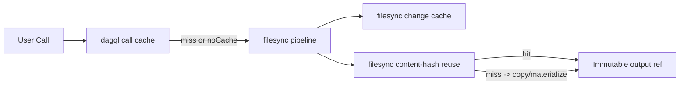
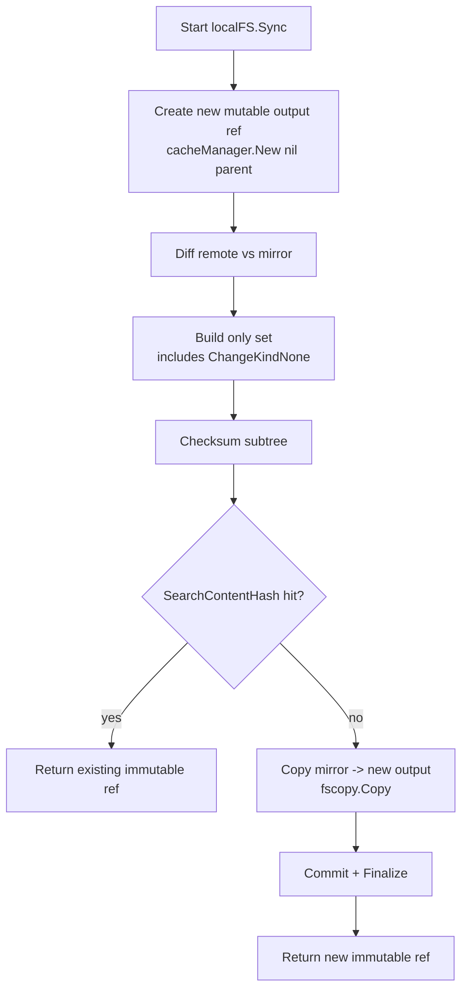
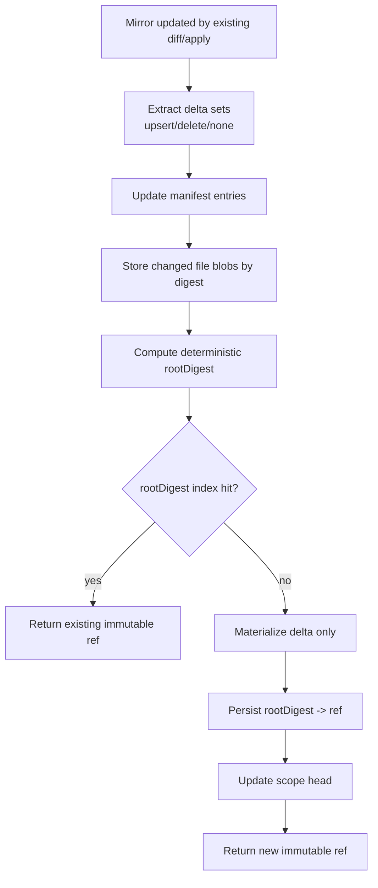
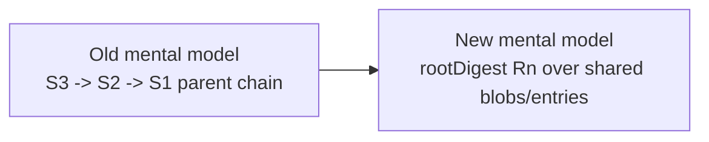
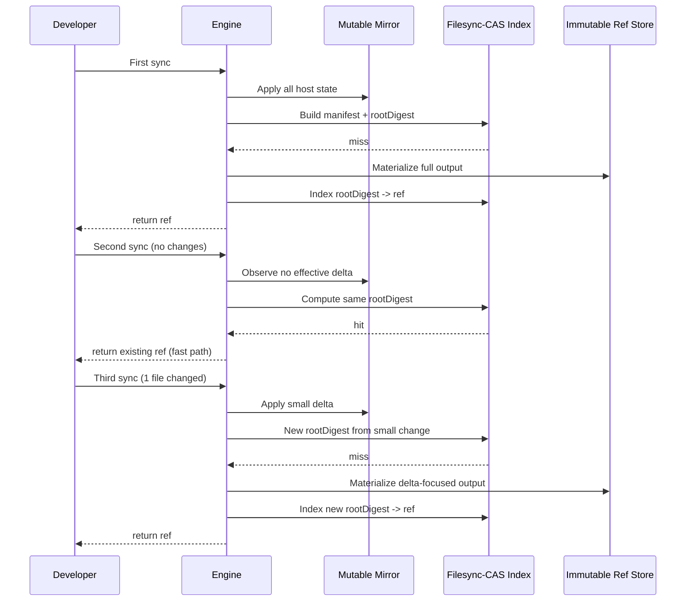

# Filesync-CAS Educational Guide

This guide is for contributors who understand Go basics but are new to Dagger engine internals.
Goal: go from junior-level context to being able to implement and ship the scoped Filesync-CAS feature defined in [`plan.md`](./plan.md).

---

## 1) What You Are Building (In One Paragraph)

Today, host imports can spend significant time re-materializing output state even for small edits.
The scoped Filesync-CAS feature keeps the existing mutable mirror sync path, then switches final snapshot identity to a content-addressed manifest root digest so unchanged content is reused by digest instead of being recopied.

You are not rewriting the platform.
You are adding a scoped, correctness-first acceleration layer to filesync output materialization.

---

## 1.1) Current Branch Status (March 5, 2026)

What is already true on this branch:

1. Monorepo cross-session integration repro exists for both:
   - host-directory path
   - `_contextDirectory` (`defaultPath="/"`) path
2. Filesync spans expose phase timing needed to isolate bottlenecks:
   - `diff_apply_ms`, `checksum_ms`, `search_ms`, `copy_ms`, `commit_ms`, `finalize_ms`, `materialize_ms`
3. Root-digest index lookup is wired before content-hash fallback.
4. Parent-based incremental materialization path is active with depth cap.
5. Scope-head state is now shared in-memory across `FileSyncer` instances with generation-checked updates.
6. Temporary warning-level perf log lines were added to accelerate analysis:
   - `filesync perf mode=... parent_based=... copy_only=... copy_ms=... materialize_ms=...`

What remains before calling the POC complete:

1. Differential parity gate (`legacy` vs `cas`) as a hard blocker.
2. Squash/rebase policy completion beyond the existing depth cap.
3. Promote the durable telemetry surface (spans/events) and remove temporary warning-level perf logs.

---

## 2) Mental Model You Need Before Touching Code

### 2.1 Immutable DAG model (why caching is possible)

Dagger execution is modeled as immutable operations over immutable values.
Cache keys derive from operation identity + immutable inputs.

Code references:
- `dagql/cache.go:71` (`CacheKey`)
- `dagql/cache.go:795` (`DoNotCache` path)
- `dagql/cache.go:924` (content-digest lookup path)
- `dagql/objects.go:346` (`preselect`)
- `dagql/objects.go:518` (`call`)

### 2.2 There are multiple caches; do not mix them up

1. `dagql` call cache:
   - Reuses resolver results based on call IDs/content digest.
   - Files: `dagql/cache.go`, `dagql/session_cache.go`.
2. filesync change cache:
   - In-memory dedupe/conflict helper for path-level mirror mutations.
   - File: `engine/filesync/change_cache.go`.
3. filesync content-hash reuse:
   - After sync, reuse an immutable ref if full subtree digest already exists.
   - File: `engine/filesync/localfs.go:476`, `engine/filesync/localfs.go:483`.

If you debug "slow second call", always identify which cache layer should have helped but did not.

### 2.3 Why second calls are sometimes fast and sometimes still slow

`host.directory` can be requested with `noCache`.
When `noCache` is set, call-level cache reuse is bypassed, but filesync still runs.

Code references:
- `core/schema/host.go:475` (`HostDirCacheConfig`)
- `core/schema/host.go:479` (`CacheType`)
- `core/host.go:130` (sets filesync `CacheBuster`)

So:
- same call + cacheable: very fast if dagql hit
- noCache or changed content: filesync path runs, and current materialization can still be heavy

### 2.4 Diagram: Cache Layers and Boundaries



```text
User Call
  |
  v
dagql call cache
  | hit
  |-------------------------------> Immutable output ref
  |
  | miss or noCache
  v
filesync pipeline
  | \
  |  \--> filesync change cache (dedupe/conflict checks)
  v
filesync content-hash reuse
  | hit
  |-------------------------------> Immutable output ref
  |
  | miss
  v
copy/materialize
  |
  v
Immutable output ref
```

---

## 3) Current Filesync Pipeline (Know This Exactly)

Start at:
- `engine/filesync/filesyncer.go:59` (`FileSyncer.Snapshot`)
- `engine/filesync/filesyncer.go:141` (`sync`)
- `engine/filesync/localfs.go:121` (`localFS.Sync`)

Current `localFS.Sync` flow:

1. Build a fresh output mutable ref:
   - `engine/filesync/localfs.go:134` (`cacheManager.New(ctx, nil, nil)`).
2. Walk/apply remote-vs-local diff into mirror.
3. Build `only` path set (includes `ChangeKindNone`):
   - `engine/filesync/localfs.go:407`.
4. Compute subtree checksum:
   - `engine/filesync/localfs.go:476`.
5. Try content-hash ref reuse:
   - `engine/filesync/localfs.go:483`.
6. On miss, copy mirror into new output:
   - `engine/filesync/localfs.go:527`.
7. Commit/finalize immutable output:
   - `engine/filesync/localfs.go:542`, `engine/filesync/localfs.go:557`.

Key consequence:
Even when only one file changed, if root digest changes and copy path includes many unchanged entries, rematerialization can be expensive.

### 3.1 Diagram: Current `localFS.Sync` Path



```text
Start localFS.Sync
  |
  v
Create new mutable output ref (empty parent)
  |
  v
Diff remote vs mirror
  |
  v
Build "only" set (includes ChangeKindNone)
  |
  v
Checksum subtree
  |
  v
SearchContentHash hit?
  | yes                         | no
  v                             v
Return existing immutable ref   Copy mirror -> new output
                                  |
                                  v
                              Commit + Finalize
                                  |
                                  v
                              Return new immutable ref
```

---

## 4) Why Hardlink Optimization Is Not The Whole Fix Here

`fscopy.Copy` hardlink optimization is guarded by safety conditions.

Code references:
- `internal/fsutil/copy/copy.go:74` (runtime guard)
- `internal/fsutil/copy/copy.go:201` (safety docs)

It requires:
- source and destination path resolvers
- no metadata mutations (`Chown`, `Utime`, `Mode`)
- safe immutable-layer conditions

Example where Dagger already uses it in a safer immutable copy path:
- `core/directory.go:797` to `core/directory.go:803`

For host filesync output materialization, this optimization alone does not solve the structural issue of repeatedly materializing large unchanged trees when identity misses.

---

## 5) Target Design (Scoped Filesync-CAS)

You keep:
- host->engine transfer protocol
- mutable mirror update logic
- include/exclude/gitignore semantics

You add:
- scoped content-addressed manifest/blob layer for snapshot identity and delta materialization.

Core structures:

1. Blob store:
   - `blobDigest -> bytes` (dedupe content by digest)
2. Entry index:
   - `path -> metadata + blobDigest/linkTarget`
3. Manifest:
   - canonical sorted entries + deterministic `rootDigest`
4. Scope head:
   - `scopeKey -> rootDigest + materializedRef + generation + chainDepth`

From a user perspective:
- no-change rerun: root hit, return existing immutable ref
- one-file change: store one new blob, update minimal manifest/tree metadata, materialize small delta

### 5.1 Diagram: Target Scoped Filesync-CAS Path



```text
Mirror updated by existing diff/apply
  |
  v
Extract delta sets (upsert/delete/none)
  |
  v
Update manifest entries
  |
  v
Store changed blobs by digest
  |
  v
Compute deterministic rootDigest
  |
  v
rootDigest index hit?
  | yes                        | no
  v                            v
Return existing immutable ref  Materialize delta only
                                 |
                                 v
                             Persist rootDigest -> ref
                                 |
                                 v
                             Update scope head
                                 |
                                 v
                             Return new immutable ref
```

### 5.2 Diagram: Snapshot Identity Shift



```text
Old model:
S3 -> S2 -> S1   (identity tied to parent-chain evolution)

New model:
R3, R2, R1 root digests over shared blobs/entries
(identity tied to content, not chain depth)
```

---

## 6) Theory You Need To Implement Correctly

### 6.1 Content addressing basics

For a regular file:
- identity = digest(file bytes)

For a directory tree:
- identity = digest(canonical representation of child entries)

Canonical representation must be:
- deterministic
- stable across map insertion order
- explicit about entry type + metadata fields included in identity

### 6.2 Identity field selection (important)

Should affect identity:
- path name
- type (file/dir/symlink/hardlink)
- file mode and ownership semantics you consider meaningful
- link target for symlink/hardlink
- content digest for regular files

Should not affect identity in phase 1:
- mtime

Reason:
- mtime drift causes false misses and weakens reuse without semantic value for this feature goal.

### 6.3 Why this avoids parent-layer-chain pain

Layer-chain model:
- each sync materializes a child from previous state
- long chains can hit depth/operational limits and expensive traversal behavior

Tree-CAS model:
- each sync identity is a root digest over shared blobs and tree nodes
- unchanged data is reused by digest directly
- no requirement that identity is parent chain depth

You still may materialize refs in backend storage, but logical snapshot identity is digest-rooted, not chain-rooted.

### 6.4 Complexity expectations

Current:
- small edit can still imply large copy/materialization work on miss

Target:
- changed bytes + changed tree path(s) dominate work
- no-change path should collapse near lookup overhead

Cold first run is not guaranteed faster; warm incremental behavior is the target win.

### 6.5 Diagram: Rerun Behavior Expectations



```text
First sync:
Developer -> Engine -> Mirror apply all -> CAS lookup (miss)
Engine -> Ref store materialize full output -> CAS index -> return ref

Second sync (no changes):
Developer -> Engine -> Mirror sees no effective delta
Engine -> CAS lookup (hit) -> return existing ref

Third sync (1 file changed):
Developer -> Engine -> Mirror apply small delta
Engine -> CAS lookup (miss) -> delta-focused materialization
Engine -> CAS index -> return new ref
```

---

## 7) Correctness Invariants (Non-Negotiable)

1. Immutability:
   - old immutable refs never change after publication.
2. Determinism:
   - same effective filesystem view => same root digest.
3. Scope isolation:
   - one scope's updates cannot mutate another scope's state.
4. Delete correctness:
   - deletions must remove entries exactly once and deterministically.
5. Filter parity:
   - include/exclude/gitignore/relativePath semantics match legacy.
6. Concurrency safety:
   - same-scope concurrent syncs are serialized via generation checks.
7. Path safety:
   - reject `..` or escapes outside root.

If any invariant breaks, stop and fix before proceeding.

---

## 8) Implementation Blueprint (Mapped To `plan.md`)

Follow commit sequence in [`plan.md`](./plan.md).
This section explains "why this order":

1. Characterize existing behavior first:
   - lock current semantics with tests so you can refactor safely.
2. Build CAS primitives in isolation:
   - scope key, manifest serialization, digesting, metadata stores.
3. Refactor delta extraction with no behavior change:
   - separates "what changed" from "how to materialize."
4. Add manifest apply + plan + exec:
   - make minimal materialization executable.
5. Wire runtime path and keep legacy oracle:
   - differential tests gate correctness.
6. Add depth policy + telemetry:
   - prevent new operational failure modes.

---

## 9) Code Examples (Reference-Quality Pseudocode)

### 9.1 Canonical entry hashing

```go
// Include only identity-relevant fields in a strict order.
func hashEntry(e Entry) Digest {
    h := sha256.New()
    writeString(h, e.Path)
    writeUint8(h, uint8(e.Kind))
    writeUint32(h, e.Mode)
    writeUint32(h, e.UID)
    writeUint32(h, e.GID)
    writeInt64(h, e.Size)
    writeString(h, e.LinkTarget)
    writeString(h, e.BlobDigest.String())
    return digest.FromBytes(h.Sum(nil))
}
```

### 9.2 Deterministic root digest

```go
func rootDigest(entries map[string]Entry) Digest {
    keys := sortedKeys(entries) // lexical sort
    h := sha256.New()
    for _, k := range keys {
        eh := hashEntry(entries[k])
        writeString(h, k)
        writeString(h, eh.String())
    }
    return digest.FromBytes(h.Sum(nil))
}
```

### 9.3 Generation-safe scope head update

```go
func updateHead(scope ScopeKey, expectedGen uint64, next Head) error {
    cur := loadHead(scope)
    if cur.Generation != expectedGen {
        return ErrGenerationConflict
    }
    next.Generation = cur.Generation + 1
    saveHead(scope, next)
    return nil
}
```

### 9.4 Differential oracle test shape

```go
func TestLegacyVsCASParity(t *testing.T) {
    tcases := corpusOfAddsModsDeletesSymlinksGitignore()
    for _, tc := range tcases {
        gotLegacy := runSnapshotLegacy(tc)
        gotCAS := runSnapshotCAS(tc)
        requireEqualTree(t, gotLegacy, gotCAS)
        requireEqualDigest(t, gotLegacy.Root, gotCAS.Root)
    }
}
```

---

## 10) Observability and Debugging

### 10.1 What to measure

Required telemetry for this feature:

1. root digest hit/miss count
2. blob hit/miss bytes
3. manifest entry count / size
4. materialization duration
5. applied delta cardinality (`upsert`, `delete`, `none`)
6. chain depth + squash count

Why:
- You need proof that "small edit stays small" in production-like runs.

### 10.2 Useful baseline command loop

```bash
dagger --progress=plain call engine-dev test \
  --pkg ./core/integration \
  --run '^TestModule/TestCrossSessionContextualDirChange$' \
  --test-verbose
```

Run sequence:

1. run once (cold baseline)
2. rerun unchanged
3. edit one file under synced context
4. rerun and compare filesync/copy/materialization spans

---

## 11) Test Strategy (Unit + Integration + Performance)

### 11.1 Unit tests (must exist before wiring runtime)

1. Scope key determinism and path safety.
2. Manifest canonical serialization.
3. Digest determinism and metadata-change sensitivity.
4. Metadata store corruption handling.
5. Blob store idempotency and digest mismatch failure.
6. Manifest delta apply matrix (add/modify/delete/link kinds).
7. Materialization planner minimality.
8. Materialization executor cleanup on failures.

### 11.2 Differential tests (hard gate)

Run legacy and CAS for same corpus; require tree parity.
No runtime-impacting commit should proceed with parity failures.

### 11.3 Integration tests (real behavior)

At minimum:

1. cross-session contextual dir change
2. delete case
3. old snapshot immutability after host change

### 11.4 Performance acceptance

Track medians over repeated runs:

1. cold run
2. warm no-change rerun
3. warm one-file-change rerun

Expected trend:
- biggest win in (2) and (3), not necessarily (1)

---

## 12) Common Failure Modes You Will Hit

1. Non-deterministic manifest ordering:
   - symptom: flaky digest/parity tests.
2. Missing delete propagation:
   - symptom: stale files reappear after edit/delete cycles.
3. Cross-scope contamination:
   - symptom: unrelated import path gets unexpected files.
4. Generation race bugs:
   - symptom: intermittent wrong head/ref mapping.
5. Treating mtime as identity:
   - symptom: excessive misses and poor incremental behavior.
6. Overfitting to one benchmark:
   - symptom: passes one test, regresses broader workloads.

---

## 13) Practical Reading Path (Junior -> Ship)

Use this sequence:

1. [`plan.md`](./plan.md) sections 1 and 2.
2. `engine/filesync/filesyncer.go` (`Snapshot`, `sync`, `getRef`).
3. `engine/filesync/localfs.go` (`Sync` end-to-end).
4. `engine/filesync/change_cache.go` (singleflight/refcount semantics).
5. `skills/cache-expert/references/filesync.md` (big-picture protocol).
6. `skills/cache-expert/references/cache-storage.md` (cache taxonomy).
7. `internal/fsutil/copy/copy.go` hardlink guards.

Do not start by coding CAS runtime wiring.
Start by locking behavior with tests and deterministic data model primitives.

---

## 14) Shipping Checklist

1. All commits in `plan.md` applied in order.
2. Differential parity suite is green.
3. Integration coverage for change/delete/immutability is green.
4. Telemetry demonstrates lower rematerialization on one-file edits.
5. No invariant violations observed under repeated reruns.
6. Docs updated (`plan.md` progress + this guide if behavior changed).

If all six are true, the scoped POC is credible and ready for staff-level review.
