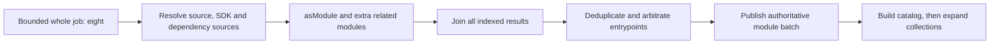
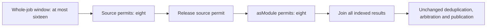

This scheduling experiment passed focused normal/race tests and a negative overlap witness, and its candidate engine has been built. No workload has run for this revision. It does not yet establish a latency improvement or production readiness.

The two fully primed check-list profiles contain nine top-level `Query.moduleSource` executions. The first eight begin around 10–14 ms; the ninth begins at 145.56 ms over direct Unix and 159.84 ms over Docker. The loader's current limit of eight covers the whole source-plus-asModule job. In the Unix profile an asModule execution ends at 145.29 ms, immediately before the ninth source starts. There is no enqueue/permit marker, so this is consistent with the known limiter rather than a direct measurement of its queue wait.

The seven Git advertisements do not all wait on that limiter. Two are nested source-dependency admissions. Two roots that started in the initial wave do not reach their first Query.git until roughly 68–72 ms later. The delayed ninth root accounts for one advertisement. `wave-evidence.json` records temporal ordinals, not guessed module identities. It does not infer source→asModule identity from nearby timestamps, or prove that the ninth root is the catalog's critical branch.

The existing flow is:

The candidate retains a bounded window of at most sixteen whole jobs, each with the existing contextual `load module` span. Within that window it independently limits source and registration phases to eight. A job releases its source permit before acquiring its registration permit. This allows another source to start while registration proceeds; it does not wait for every source before registering any module.

This is not an I/O-versus-CPU limit: `Query.moduleSource` already resolves dependency sources and can register an SDK. The total number of expensive top-level operations can therefore rise from eight to sixteen. The implementation does not create an unbounded goroutine per source; the existing bounded parallel worker pool still runs and joins the jobs. Nested SDK/dependency calls do not acquire these top-level batch permits, avoiding recursive semaphore deadlocks. No engine-wide CPU or memory limit is established by these two stage limits.

The source factorization retains exactly the existing selector arguments, source result, caller context, legacy source policy, asModule variant/default arguments, related toolchain/blueprint handling, and indexed non-fail-fast errors. It does not pre-probe raw URLs, reuse authorization across sessions, install modules early, execute collection receivers early, or bypass the owner’s `modulesMu`/`stateMu` publication flow. The separate load-to-expansion proposal in `warm-audit/module-load-overlap/pipeline-review.md` has larger authority and reentrancy requirements and is not implemented here.

Four scheduler witnesses exercise actual overlap while registration is blocked, both phase high-water limits and the bounded whole-job window, per-index source/module errors with successful siblings, and cancellation that joins started work and returns permits. Existing focused module error, deduplication, identity and entrypoint tests are included in the recipe. Twelve top-level focused test groups passed in both normal and race modes. These tests are not a substitute for normal real-UX validation.

The next gate is a matched engine comparison after the completed independent source review and focused normal/race validation. The frozen control is the existing Git/context diagnostic engine; the candidate adds only this scheduling change. Ordinary CLI timings must remain separate from profiling. Use the same source bytes and output expectations, run both comparison orders, preserve the current SDK stack and source freshness, and check full failure/recovery behavior. Warm discovery is only the first gate. A production proposal also needs fresh-volume and larger-workspace peak memory/CPU/process counts, because overlap may trade latency for resource pressure. No prediction that the whole 385 ms Git union is removable is justified by these profiles.

The first compile attempt stopped because the factorization left an unused import; no tests or build ran in that attempt. It is preserved under `attempt-1`. After removing only that obsolete import, normal and race package execution took 0.032 s and 1.149 s respectively (compile/setup excluded). Restoring the old eight-job outer window makes the overlap witness fail at its bounded five-second progress assertion; cancellation then joins all workers, with no cleanup failure. The frozen recipe is `f55023bca3336878e8d4c35b5fdf2a8106337ca5cfea216cee23246b2e31bffa`. `manifest.json` records the exact engine and CLI hashes. The recipe remains the immutable pre-execution plan; `validation.json` records actual outcomes.
